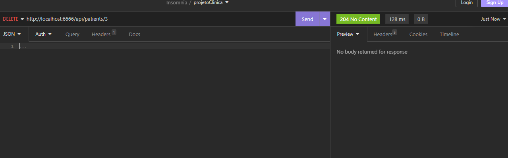
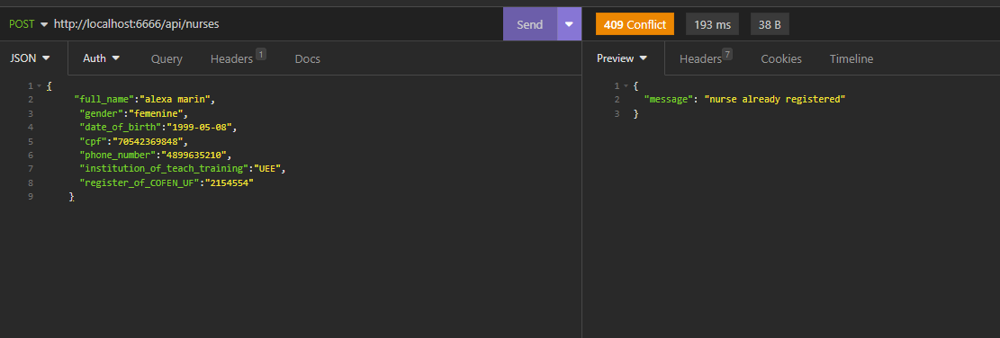

<h1 align="center"> Lab Medicine </h1>
<p align="center">
Lab medicine é um gerenciador de API baseado no funcionamento de uma clínica, esse aplicativo foi criado para poder adicionar pacientes, médicos e enfermeiros, você também pode atualizar, mostrar os dados de todos ou de cada um individualmente e excluí-los de suas listas e registrar cada vez que é marcada uma consulta e com qual médico o paciente foi atendido

Este aplicativo ajudará você a manter seus dados organizados criando um identificador para cada pessoa, também oferece
a possibilidade de modificá-lo em tempo real gerando dados confiáveis.

</p>

<h2 align="center"> Tecnologias utilizadas<h2/>

<li>ES6(ECMASCRIPT)</li>
<p>como linguagem base do nosso projeto</p>

<br><br>

<li>PostgreSQL</li>
<p>como gerenciador de banco de dados</p>

<br>

<li>Sequelize</li>
<p>com o Sequelize podemos usar a linguagem de programação que já estamos usando no backend para conectar e operar o banco de dados.</p>
 
<br>

<li>Express</li>
<p>vai nos ajudar a gerenciar requisições de diferentes verbos http em diferente URLs</p>

<br>

<li>Insomnia</li>
<p>Este framework vai nos ajudar a testar nossas requisições corretamente</p>

<br>

<h2>Descrição de como executar</h2>

Clone o projeto

```bash
  git clone https://github.com/miche0077/Project-LabMedicine.git
```

Entre no diretório do projeto

```bash
  cd my-project
```

Instale as dependências

```bash
  npm install
  npm install --save sequelize
  npm install express --save
  npm install pg pg-hstore
```

Inicie o servidor

```bash
  npm start

```

<h2> Como esta organizado?</h2>
<p>
Pasta SRC, contém subdiretórios para controladores, banco de dados, modelos e rotas. 
O diretório CONTROLLERS possui subdiretórios para os módulos do projeto, incluindo services, doctors, nurses e patients. 
O diretório DATABASE contém o arquivo index.js com dados de conexão com o banco de dados.
O diretório MODELS inclui arquivos de modelo para criar  controladores com base em seus atributos.
ROUTES possui as rotas URL padrão </p>

[]

<h2>Gerenciando Patients</h2>
<h3>Cadastro</h3>
<p> Para cadastrar um novo paciente deve preencher os dados requeridos e você deve usar a seguinte rota: </p>

```http
  POST /api/patient
```

<p> Sera  **obrigatorio** </p>
1. emergency_contact
2. date_of_birth
3. cpf

<br>
<i> Será verificado se o cpf já está cadastrado no banco de dados se já estiver cadastrado não poderá continuar com o cadastro </i>
<em>Exemplo</em>


<h2>Resposta de sucesso</h2>

```
{
	"id": 3,
	"full_name": "carol",
	"gender": "female",
	"date_of_birth": "1999-11-07",
	"cpf": "80074446381",
	"phone_number": "4899504120",
	"emergency_contact": "4799058741",
	"list_of_alergies": "cats",
	"list_of_specific_care": "none",
	"health_insurance": "SASS",
	"service_status": "WAITING_FOR_SERVICE",
	"total_atendimentos": 0,
	"updatedAt": "2023-04-19T17:36:59.210Z",
	"createdAt": "2023-04-19T17:36:59.210Z"
    }
```


<p>O seu cadastro gero um identificador pessoal!!</p>


<h3>Atualizando Patients</h3>
<p> Para atualizar um paciente deve preencher os dados requeridos e informar o identificador(id) do paciente que quer atualizar você deve usar a seguinte rota: </p>

```http
  PUT /api/patient/:id
```

<p> Sera  **obrigatorio** </p>

1. emergency_contact
2. date_of_birth
3. cpf

<i> Será verificado se o cpf já está cadastrado no banco de dados se já estiver cadastrado não poderá continuar com o cadastro </i>

<em>Exemplo</em>


<p>Patient atualizado com sucesso!!</p>

<h3>Atualizando Status Service </h3>
<p> Para atualizar o status de um paciente deve preencher o estado do atendimento  e informar o identificador(id) do paciente que quer atualizar você deve usar a seguinte rota: </p>

```http
  PUT /api/patients/:id/service_status
```

<p> Sera  **obrigatorio** </p>

1. service_status
2. preencher com uma das seguintes opções
    ```"WAITING_FOR_SERVICE",
      "IN_SERVICE",
      "ATTENDED",
      "NOT_ATTENDED"```
3. informar ID

<i> Será verificado se o service_status esta correto e se o id existe </i>


<em>Exemplo no caso que o id não exista</em>


<em>Exemplo de sucess!</em>


<h3>Encontrando todos os Patients</h3>

<p> Para encontrar os patients você deve informar o service_status que deseja chamar no url no caso de não chamar um service_status especifico sera retornado todos os patients você deve usar a seguinte rota: </p>

```http
  GET /api/patients?service_status=
```
<p> Sera  **obrigatorio** </p>

1. service_status
2. preencher com uma das seguintes opções:

    ```"WAITING_FOR_SERVICE",
      "IN_SERVICE",
      "ATTENDED",
      "NOT_ATTENDED"```

<em>Exemplo</em>


<h3>Encontrando Patients pelo id</h3>

<p> Para encontrar os patients pelo id você deve informar o id que deseja chamar no url você deve usar a seguinte rota: </p>

```http
  GET /api/patients/:id
```
<p> Sera  **obrigatorio** </p>

1. informar id 
2. que o id esteja no banco de dados 

 
<em>Exemplo no caso que o id não exista</em>


<em>Exemplo de sucess!</em>


<h3>DELETE dos Patients pelo id</h3>
<p> Para deletar os patients pelo id você deve informar o id que deseja chamar no url você deve usar a seguinte rota: </p>
```http
  DELETE /api/patients/:id
```

<p> Sera  **obrigatorio** </p>

1. informar id 
2. que o id esteja no banco de dados 


<em>Exemplo no caso que o id não exista</em>


<em>Exemplo de sucess!</em>



<h2>Gerenciando Doctor</h2>

<h3>Cadastro</h3>
<p> Para cadastrar um novo Doctor deve preencher os dados requeridos e você deve usar a seguinte rota: </p>

```http
  POST /api/doctors
```
<p> Será  **obrigatorio** </p>

1.  date of birth
2.  institution of teach training
3.  register to CRM/UF 
4.  clinical specialization

<br>
<i> Será verificado se o cpf já está cadastrado no banco de dados se já estiver cadastrado não poderá continuar com o cadastro </i>

<em>Exemplo de sucess!</em>


<em>Exemplo de que o doctor ja exista</em>


<h3>Atualizando Doctor</h3>
<p> Para atualizar os dados de um Doctor deve informar o identificador(id) do doctor no URL  e precher os dados que quer atualizar você deve usar a seguinte rota: </p>

```http
  PUT /api/doctors/:id
```

<p> Sera  **obrigatorio** </p>

1.  date of birth
2.  institution of teach training
3.  register to CRM/UF 
4.  clinical specialization

<br>
<i> Será verificado se o id do doctor existe! </i>


<em>Exemplo no caso que o id não exista</em>


<em>Exemplo de sucess!</em>


<h3>Atualizando Doctor Status </h3>
<p> Para atualizar o status de um Doctor deve preencher o estatus_in_the_system e informar o identificador(id) do doctor que quer atualizar você deve usar a seguinte rota: </p>

```http
  PUT /api/doctors/:id/status_in_the_system
```

<p> Sera  **obrigatorio** </p>

1. status_in_the_system
2. preencher com uma das seguintes opções
    ```
    "ACTIVE"
    "INACTIVE"
      ```
3. informar ID

<i> Será verificado se o status_in_the_system esta correto e se o id do doctor existe </i>


<em>Exemplo no caso que o id não exista</em>


<em>Exemplo de sucess!</em>


<h3>Encontrando todos os Doctor</h3>

<p> Para encontrar os doctors você deve informar o status_in_the_system que deseja chamar no url no caso de não chamar um status_in_the_system especifico sera retornado todos os doctors você deve usar a seguinte rota: </p>

```http
  GET /api/patients?service_status=
```
<p> Sera  **obrigatorio** </p>

1. service_status
2. preencher com uma das seguintes opções:

    ```"WAITING_FOR_SERVICE",
      "IN_SERVICE",
      "ATTENDED",
      "NOT_ATTENDED"```

<em>Exemplo no caso que o status_in_the_system não exista</em>


<em>Exemplo de status_in_the_system não especificado</em>


<em>Exemplo de especificar status_in_the_system</em>


<h3>Encontrando Doctors pelo id</h3>

<p> Para encontrar os doctors pelo id você deve informar o id que deseja chamar no url você deve usar a seguinte rota: </p>

```http
  GET /api/doctors/:id
```
<p> Sera  **obrigatorio**  informar um id valido </p>

<em>Exemplo no caso que o id não exista</em>


<em>Exemplo de sucess!</em>


<h3>DELETE dos Doctors pelo id</h3>
<p> Para deletar os doctor pelo identificador você deve informar o id que deseja chamar no url você deve usar a seguinte rota: </p>

```http
  DELETE /api/doctors/:id
```

<p> Sera  **obrigatorio** </p>

1. informar id 
2. que o id esteja no banco de dados 


<em>Exemplo no caso que o id não exista</em>


<em>Exemplo de sucess!</em>


<h2>Gerenciando Nurse</h2>

<h3>Cadastro</h3>
<p> Para cadastrar um novo Nurse(enfermeiro) deve preencher os dados requeridos e você deve usar a seguinte rota: </p>

```http
  POST /api/nurses
```
<p> Será  **obrigatorio** </p>

1. date_of_birth
2. institution_of_teach_training 
3. register_of_COFEN_UF

<br>
<i> Será verificado se o cpf já está cadastrado no banco de dados se já estiver cadastrado não poderá continuar com o cadastro </i>

<em>Exemplo no caso que o id ja exista</em>


<em>Exemplo de sucess!</em>


<h3>Atualizando Nurse</h3>
<p> Para atualizar os dados de um enfermeiro deve informar o identificador(id) do enfermeiro no URL  e precher os dados que quer atualizar você deve usar a seguinte rota: </p>

```http
  PUT /api/nurses/:id
```

<p> Sera  **obrigatorio** </p>

1. date_of_birth
2. institution_of_teach_training 
3. register_of_COFEN_UF

<br>
<i> Será verificado se o id do enfermeiro existe! </i>


<em>Exemplo no caso que o id não exista</em>


<em>Exemplo de sucess!</em>


<h3>Encontrando todos os Nurses</h3>

<p> Para encontrar os enfermeiros  você deve usar a seguinte rota: </p>

```http
  GET /api/nurses
```
<p> Sera  **obrigatorio** </p>


<em>Exemplo de suceso!</em>


<h3>Encontrando Nurses pelo id</h3>

<p> Para encontrar os enfermeiros pelo id você deve informar o id que deseja chamar no url você deve usar a seguinte rota: </p>

```http
  GET /api/nurses/:id
```
<p> Sera  **obrigatorio**  informar um id valido </p>

<em>Exemplo no caso que o id não exista</em>


<em>Exemplo de sucess!</em>


<h3>DELETE nurse pelo id</h3>
<p> Para deletar os enfermeiros pelo identificador você deve informar o id que deseja chamar no url você deve usar a seguinte rota: </p>

```http
  DELETE /api/nurses/:id
```

<p> Sera  **obrigatorio** </p>

1. informar id 
2. que o id esteja no banco de dados 


<em>Exemplo no caso que o id não exista</em>


<em>Exemplo de sucess!</em>


<h2>Gerenciando Atendimentos</h2>

<h3>Cadastro</h3>
<p> Para cadastrar um novo atendimento deve preencher os dados requeridos e você deve usar a seguinte rota: </p>

```http
  POST /api/atendimentos
```
<p> Será  **obrigatorio** </p>

1.  doctor_id
2.  patient_id


<br>
<i> Será verificado se os id existem no banco de dados por cada atendimento criado sera incrementado no registro dos atendimentos do Doctor e do Patient </i>

<em>Exemplo de sucess!</em>


<em>Exemplo de que algum id não exista</em>

